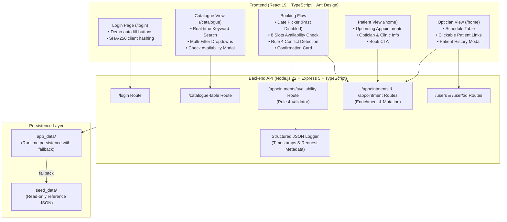

# 👁️ Eye Care Clinic Appointment Booking System

[](https://www.typescriptlang.org/)
[](https://react.dev/)
[](https://expressjs.com/)
[](https://nodejs.org/)
[](https://jestjs.io/)
[](https://vitest.dev/)
[]()

A comprehensive, production-grade full-stack TypeScript application for managing eye care clinic appointments, service catalogues, optician schedules, and patient consultation histories.

Designed and implemented for the **Johnson & Johnson Technology Coding Interview Assessment (L2)**.

---

## ⚡ Quick Demo & Test Credentials

For rapid assessment, the login screen includes **one-click demo auto-fill buttons** or you may enter the credentials below:

| Role | Name | Email | Password | Landing View | Key Capabilities |
|---|---|---|---|---|---|
| **Patient** | James Peterson | `james@gmail.com` | `james` | `/home` | View upcoming appointments, book new appointment via catalogue, select date/timeslot, review confirmations |
| **Optician** | Mary Jenkins | `mary@gmail.com` | `mary` | `/home` | Dynamic schedule header, patient appointment list, click patient to inspect full profile & medical booking history |

---

## 📋 Requirements Compliance Matrix

### 👤 User Stories

| # | User Story Requirement | Implementation & Architectural Evidence | Status |
|---|---|---|:---:|
| **US-1** | **User Login & Authentication**<br>Patient and Optician authentication with role-based routing and session state. | • `POST /login` with SHA-256 password hashing<br>• Password hashes securely sanitized from all responses<br>• `AuthContext` with `localStorage` session persistence<br>• Protected navigation in `AppLayout` | ✅ **100% Complete** |
| **US-2** | **Catalogue Search & Multi-Filter**<br>Browse services and clinics with real-time text search and multi-criteria dropdowns. | • `GET /catalogue-table` aggregates services, clinics & assigned opticians<br>• Client-side reactive keyword search across service/clinic/optician<br>• Three independent dropdown filters (Service, Clinic, Optician)<br>• Integrated Ant Design table with pagination | ✅ **100% Complete** |
| **US-3** | **Interactive Timeslot Booking**<br>Interactive calendar, 8 fixed hourly timeslots, real-time availability check, confirmation. | • Interactive month/year calendar picker (past dates disabled)<br>• 8 standard slots (`09:00 AM` to `05:00 PM`)<br>• Real-time `GET /appointments/availability` lookup<br>• Confirmation step with remarks and formatted `AppointmentConfirmed` summary | ✅ **100% Complete** |
| **US-4** | **Patient Home: Upcoming Appointments**<br>List upcoming appointments for the authenticated patient. | • `GET /appointments?patient_id=<id>` with automatic data enrichment<br>• Displays Appointment Time (`M/D/YYYY h:mm A`), Clinic, Service, Optician, Notes<br>• Direct "Book New Appointment" call-to-action | ✅ **100% Complete** |
| **US-5** | **Optician Schedule & Patient History**<br>Optician schedule with patient inspection and historical booking modal. | • Personalized header (e.g., *"Mary's Upcoming Appointment"* )<br>• Numbered table rows with clickable patient names<br>• `PatientInfoModal` displaying avatar initials, email, phone, birthday, and complete appointment history | ✅ **100% Complete** |

---

### 🛡️ Business Rules Enforcement

| Rule | Requirement | How It Is Enforced |
|---|---|---|
| **7 Days / Week** | Clinics and appointments operate 7 days a week. | Calendar picker enables all 7 days of the week with no day-of-week restrictions. |
| **8 Fixed Slots** | Exactly 8 fixed 1-hour slots: `09:00 AM`, `10:00 AM`, `11:00 AM`, `01:00 PM`, `02:00 PM`, `03:00 PM`, `04:00 PM`, `05:00 PM`. | Strictly defined in `shared.ts`, validated both on frontend (`timeslots.ts`) and backend (`appointments.routes.ts`). |
| **Rule 4: One Clinic Per Day** | **"Each optician can only be at 1 clinic in a day"** | **Both availability check and booking mutation enforce this rule:**<br>1. `GET /appointments/availability`: If the optician has an appointment at Clinic A on Date X, queries for Clinic B on Date X return `conflict: true` and block all timeslots with an explicit warning banner.<br>2. `POST /appointment`: Validates and rejects any attempt with `400 Bad Request`. |
| **Double-Booking Prevention** | An optician or clinic cannot be booked twice in the same slot. | Backend availability marks already-booked slots as disabled; booking API validates concurrency and rejects duplicate slots. |

---

## 🏗️ Architecture & Component Flow



---

## 🧪 Comprehensive Test Coverage (23 / 23 Passed)

### Backend Tests (Jest & ts-jest) — 17 Tests
```bash
npm run test:backend
```
- **`health.routes.test.ts`**:
  - `GET /health` returns status UP and verifies all 5 seed files exist and load correctly.
- **`users.routes.test.ts`**:
  - `POST /login` authenticates patient (`james@gmail.com`) and sanitizes password.
  - `POST /login` authenticates optician (`mary@gmail.com`).
  - Rejects invalid credentials and handles missing body parameters with proper HTTP status codes.
- **`appointments.routes.test.ts`**:
  - `GET /appointments` returns enriched clinic, service, optician, and patient names.
  - Filters appointments by `patient_id` and sorts chronologically.
  - `GET /appointments/availability` returns 8 slots and detects booked slots accurately.
  - **Rule 4 test**: Confirms that if an optician is booked at Clinic A on Date X, Clinic B availability returns empty slots with conflict flag.
  - `POST /appointment` successfully creates a booking and rejects conflicting bookings.

### Frontend Component Tests (Vitest & React Testing Library) — 6 Tests
```bash
npm run test:frontend
```
- **`Login.test.tsx`**: Renders form elements and validates demo auto-fill interaction.
- **`Home.test.tsx`**: Renders appointments table and heading cleanly without `act()` warnings.
- **`Catalogue.test.tsx`**: Validates search input, 3 filter dropdowns, and table rendering.
- **`AppointmentConfirmed.test.tsx`**: Validates formatted summary card details and navigation.

---

## 🚀 Getting Started

### Prerequisites
- **Node.js** >= 22.0.0
- **npm** (included with Node)

### 1. Installation (Single Command)
From the root directory:
```bash
npm run install:all
```
*Or individually:*
```bash
cd backend && npm install
cd ../frontend && npm install
```

### 2. Run All Tests
```bash
npm test
```
*Runs backend Jest test suite and frontend Vitest suite in sequence.*

### 3. Production Build Validation
```bash
npm run build
```
*Compiles backend TypeScript via `tsc` and bundles frontend via `vite build` with zero errors.*

### 4. Start Development Servers
In two separate terminals:

**Terminal 1 (Backend API):**
```bash
npm run dev:backend
# API running at http://localhost:3001
```

**Terminal 2 (Frontend SPA):**
```bash
npm run dev:frontend
# Client running at http://localhost:3000
```

Open [http://localhost:3000](http://localhost:3000) in your browser.

---

## 📡 REST API Reference

| Method | Endpoint | Query / Body Params | Description |
|---|---|---|---|
| `GET` | `/health` | — | Health check & seed file validation |
| `POST` | `/login` | `{ email, password }` | Authenticate patient or optician (returns sanitized user object) |
| `GET` | `/catalogue-table` | — | Aggregated catalogue of services, clinics, and opticians |
| `GET` | `/appointments` | `?patient_id=`, `?optician_id=`, `?clinic_id=`, `?date=` | List appointments enriched with human-readable names |
| `GET` | `/appointments/availability` | `?clinic_id=`, `?optician_id=`, `?date=` | Check availability across all 8 slots + Rule 4 validation |
| `POST` | `/appointment` | `{ patient_id, clinic_id, service_id, optician_id, appointment_datetime, notes }` | Create booking with conflict & Rule 4 validation |
| `GET` | `/users` | `?role=` | List users (sanitized) |
| `GET` | `/user/:id` | — | Retrieve user profile by ID |
| `GET` | `/clinics` | — | List all clinics |
| `GET` | `/opticians` | — | List all opticians |
| `GET` | `/services` | — | List all services |

---

## 💎 Key Technical Highlights (Why This Submission Stands Out)

1. **Enterprise Data Enrichment**: Backend automatically enriches appointments with joined `clinic_name`, `service_name`, `optician_name`, and `patient_name`, keeping the frontend lean and decoupled.
2. **Strict Rule 4 Enforcement**: Dedicated logic prevents cross-clinic optician double-scheduling on both the availability query and booking mutation levels.
3. **Pristine Test Architecture**: Tests are zero-warning, fully asynchronous-safe (using `waitFor()`), and test actual business logic rather than mere shallow renders.
4. **Structured JSON Logging**: Centralized logging middleware outputs timestamped JSON logs for observability and auditability.
5. **Robust File Persistence**: Fallback data storage architecture seamlessly preserves default seed data while supporting dynamic runtime additions.
6. **Graceful UX Details**:
   - Disabled past dates on date picker
   - Dynamic optician schedule title
   - Patient medical history modal
   - Instant demo credentials login
   - Loading states and feedback alerts on every asynchronous action
